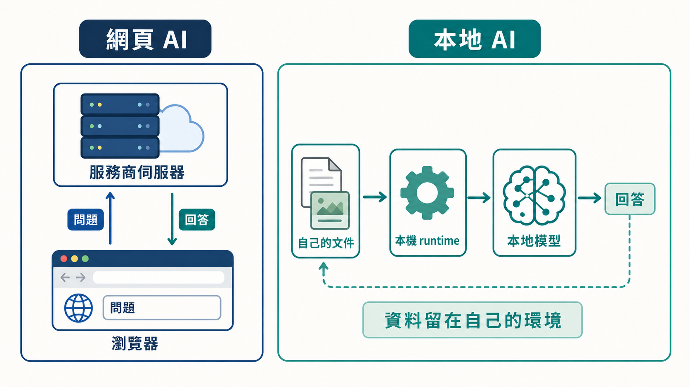
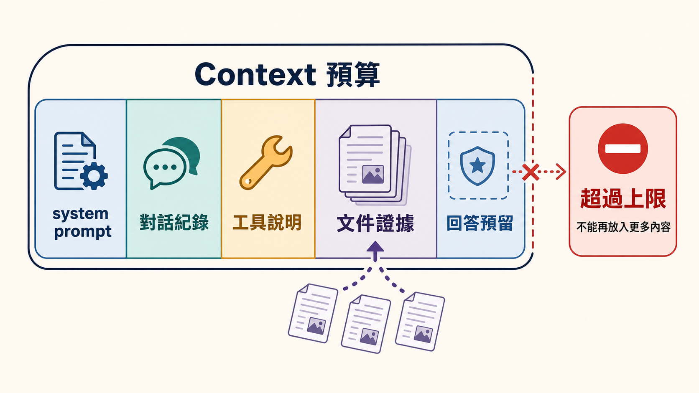
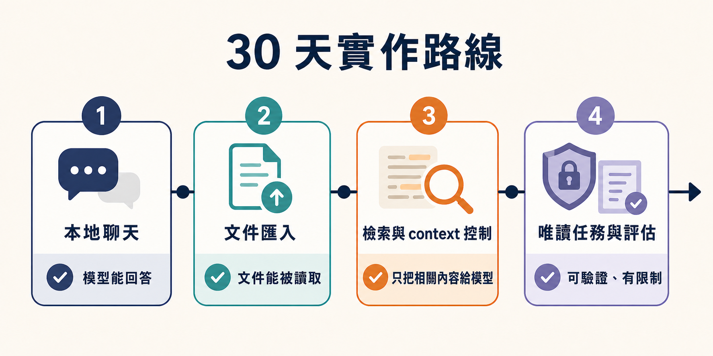

# AI Engineering 研究前線：30 天讀懂一週一週長出來的技術脈絡

## Day 1：用一台筆電開始本地 AI

如果你只用過 ChatGPT、Claude 或 Gemini 這類網頁對話式 AI，那麼第一次在自己的電腦上架設本地模型，很可能會一頭霧水：

### 為什麼這麼難用！？

覺得難用可能還是小問題，大多數人甚至完全不知道下一步要做什麼。平常在網頁上聊天時，模型放在哪裡、怎麼載入、用了多少記憶體，網站都幫我們藏好了。換成本地執行，這些問題會一次蹦出來。

所以讓我們從頭開始，從下載安裝本地模型，到可以正常對話、讀取自己的文件，最後做出一個能幫忙查資料的本地知識助理。

Repository：https://github.com/gilbertytw-lab/ai-engineering-frontier.git

<!-- 圖片建議 1｜本專案自行生成。發布前檢查圖中文字、資料流與賽事規範。 -->



## 什麼是本地模型？

先把「模型」和「可以使用模型的程式」分開看。

模型本身比較像一組很大的資料檔案，裡面保存了訓練後的參數。它不會自己跳出一個聊天視窗，也不會自己讀懂 Markdown。還需要一個負責載入模型、處理輸入、執行推論，再把結果傳回來的程式。這個程式通常叫做 runtime。你可以把它想成模型的執行環境，但現在不用先記這個名詞，先知道它負責「把模型跑起來」就夠了。

一次最基本的本地對話，大概會經過這幾步：

```text
模型檔案
  → runtime 載入模型
  → 把問題轉成模型看得懂的格式
  → 模型逐步產生文字
  → runtime 把結果顯示出來
```

網頁 AI 把這些事情包在服務商的伺服器裡。我們只需要開瀏覽器、輸入問題；本地 AI 則把其中一部分工作搬回自己的電腦，所以也必須自己處理模型版本、記憶體、儲存空間和執行速度。

這不代表本地模型一定比較好。它的好處是資料可以留在自己的環境，模型和設定也比較容易自己控制；代價是電腦要負責這些工作。記憶體不夠，模型可能載不進去；就算載得進去，也可能慢到不適合日常使用。

另外，「資料在本機」也不是一句保證。只要 runtime、外掛或我們自己寫的程式還會把問題送到外部 API，資料就可能離開電腦。這個系列會把本地模型、文件和檢索流程拆開記錄，之後才有辦法確認每一段資料去了哪裡。

## 30 天後要留下什麼

這個專案叫做 Local Engineering Knowledge Assistant。讀者把自己的 Markdown 或文字文件放進去，提出問題，系統從文件找證據，再交給本地模型回答。

這裡的「知識助理」不是把整個資料夾丟給模型。每次提問時，系統都要先從文件中找出可能相關的片段，再把少量內容放進這一次請求的 context。Context 可以先理解成模型這一輪工作時看得到的文字範圍，裡面可能同時放了 system prompt、對話紀錄、工具說明、文件證據和預留的回答空間。

它有大小上限，而且不是放越多越好。文件太少，模型找不到答案；文件太多，真正有用的內容反而被淹沒，也會讓處理時間和記憶體使用量增加。

<!-- 圖片建議 2｜本專案自行生成。發布前檢查各 context 區塊與「超過上限」的示意是否容易理解。 -->



那到底該怎麼做呢？先讓我賣個關子．

這 30 天會先做出能聊天的版本，再加入文件整理和檢索，最後才讓模型使用受限制的工具。每一步都留下當時的程式和結果，你可以在中途停下來，也可以換成自己的文件繼續做。

<!-- 圖片建議 3｜本專案自行生成。發布前確認四個階段與文章計畫一致，避免塞入文章沒有說明的功能。 -->



## 今天的環境

我的筆電是 MacBook Air，10 核心、32 GB 記憶體，預計先測試 Qwen3.8 27B 級距的本地模型。

27B 代表模型大約有 270 億個參數。若使用 4-bit 版本，光用最粗略的算法，模型權重約需要 `27B × 4 ÷ 8 ≈ 13.5 GB`；實際執行還要加上 runtime、對話快取、系統和其他程式使用的記憶體。因此 32 GB 不等於有 32 GB 可以全部拿來放模型，能不能跑得順要以實測為準。

實際要使用哪款模型要取決於你的硬體條件。硬體比較弱的話可以換小一點的模型，整套流程仍然可以照做；這個系列真正要學的是怎麼把模型接到文件、檢索和回答流程，不是一定要使用同一個模型。

Day 2 在本機成功呼叫模型，記下模型、runtime、硬體和最小輸入輸出結果。
