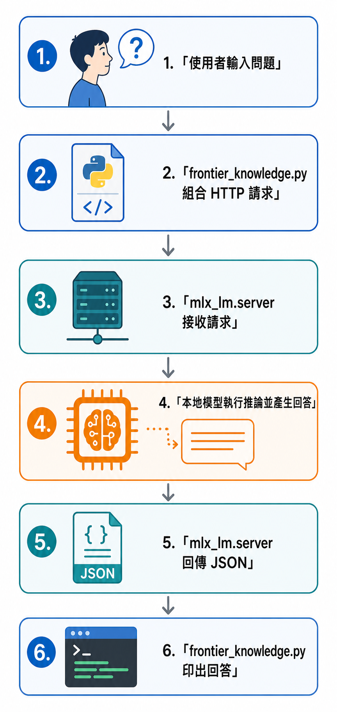

# AI Engineering 研究前線：30 天讀懂一週一週長出來的技術脈絡

## Day 2：與本地模型第一次對話

Day 1 先把本專案要處理的問題說清楚：從網頁 AI 走到本地 AI 後，模型放在哪裡、怎麼載入、記憶體怎麼使用，都會變成自己要面對的事情。

[GitHub Repository](https://github.com/gilbertytw-lab/ai-engineering-frontier)

## 今天要完成的目標

今天要在這台電腦上啟動一個本地模型，從 Python 程式送出問題、取得回覆，並記錄實際使用的模型、runtime 和版本。

## 先看整體流程

今天的流程可以先縮成六個步驟：

```text
使用者輸入問題
    ↓
frontier_knowledge.py 組合 HTTP 請求
    ↓
mlx_lm.server 接收請求
    ↓
本地模型執行推論並產生回答
    ↓
mlx_lm.server 回傳 JSON
    ↓
frontier_knowledge.py 印出回答
```



## 今天會使用哪些檔案

- [`pyproject.toml`](https://github.com/gilbertytw-lab/ai-engineering-frontier/blob/main/pyproject.toml)：告訴 `uv` 專案使用 Python 3.13，以及需要安裝的 `mlx-lm`。
- [`frontier_knowledge.py`](https://github.com/gilbertytw-lab/ai-engineering-frontier/blob/main/frontier_knowledge.py)：把問題送到本地 runtime，再印出模型回答。

執行 `uv` 指令後，資料夾還會出現 `.python-version`、`.venv` 和 `uv.lock`。這些由工具產生，不需要手動撰寫。後面的命令都假設你人在 Repository 根目錄執行。

## 從安裝 uv 開始

今天先安裝 `uv`，再使用 Repository 裡的 Day 2 檔案。

### macOS

在終端機執行：

```bash
curl -LsSf https://astral.sh/uv/install.sh | sh
exec "$SHELL"
uv --version
```

`exec "$SHELL"` 會重新載入目前的 shell 設定，讓剛安裝的 `uv` 可以在這個終端機使用。

## 檢查 Repository 裡的程式

請直接開啟 Repository 裡的 `pyproject.toml` 與 `frontier_knowledge.py`。這篇文章只說明它們在整體流程中的位置，不在文章內重複放完整內容：

- `pyproject.toml` 負責宣告 Python 版本與 `mlx-lm` 依賴。
- `frontier_knowledge.py` 負責組出第一個請求，送到本地的 MLX-LM server，再把回覆印出來。

這支程式沒有使用第三方 Python 套件。它只負責組合一個 HTTP 請求、送出問題、讀取 JSON 回覆，再把答案印出來。它目前還不是 agent，也沒有讀檔、搜尋或工具呼叫；今天只先確認「我們可以用程式跟模型說話」。

### 建立 Python 環境

`uv` 可以下載指定的 Python 版本，再為專案建立隔離環境。依序執行：

```text
uv python install 3.13
uv python pin 3.13
uv venv --python 3.13
uv sync
```

`uv python pin 3.13` 會在專案資料夾留下 `.python-version`。`uv sync` 會讀取 Repository 裡的 `pyproject.toml`，建立 `.venv`、`uv.lock`，並安裝 `mlx-lm` 與其依賴。這時候可以確認環境：

```text
uv run python --version
uv run python -c "import mlx; import mlx_lm; print('MLX-LM ready')"
```

## 先把三個名詞分開

這裡會同時看到模型、runtime 和程式，三者各自負責不同工作。

- 模型是已經訓練好的參數檔案，負責根據輸入逐步產生下一段文字。
- runtime 是把模型載入記憶體、執行推論，並提供呼叫介面的服務。這篇使用 `mlx_lm.server`。
- `frontier_knowledge.py` 是我寫的呼叫端程式，負責把問題包成 HTTP 請求，送給 runtime，再把回答印出來。

「推論」在這裡指模型拿著已載入的參數，根據目前的輸入計算並產生回答。使用者只需要輸入問題，推論發生在本地 runtime 裡。

這條流程的重點是：程式先把問題送給 runtime，runtime 再交給已載入的本地模型執行推論，回答沿著同一個 HTTP 連線回到程式。

## 為什麼選 MLX-LM

這次選擇 `mlx-lm`，因為目前以 macOS Apple Silicon 作為實作環境。它可以在本機載入模型，並提供 OpenAI-compatible HTTP 介面，讓 `frontier_knowledge.py` 透過 HTTP 送出問題。

macOS 路徑使用的模型是：

```text
mlx-community/Llama-3.2-3B-Instruct-4bit
```

名稱裡的 `3B` 可以先理解成模型的參數規模；`4bit` 是較省記憶體的量化版本。本次使用這個模型完成本地服務啟動與基本呼叫測試。

今天使用它確認本機服務可以載入模型並回傳文字。模型檔案會放在本機快取，專案內的工具與快取目錄也一併列為本機產物。

## 啟動本地 runtime

這次實際驗證的版本是：

```text
Python 3.13.15
uv 0.12.6
mlx 0.32.2
mlx-lm 0.31.3
```

需要開兩個終端機。第一個終端機啟動服務：

```bash
uv run mlx_lm.server \
  --model mlx-community/Llama-3.2-3B-Instruct-4bit \
  --port 8081
```

這個指令會讓 runtime 在本機的 `8081` port 等待請求。服務只綁在 `127.0.0.1`，這個網址代表目前這台電腦。本專案固定使用 `8081`，讓模型服務和其他常見的本機服務分開。

如果終端機顯示 `Address already in use`，代表 `8081` 已被其他程式使用。先選一個空的 port，例如 `8091`，啟動服務時使用同一個 port，呼叫程式再加上 `--base-url http://127.0.0.1:8091/v1`。

第二個終端機先確認服務已經載入模型：

```bash
curl http://127.0.0.1:8081/v1/models
```

回傳內容會是一段 JSON，裡面應該能看到：

```text
mlx-community/Llama-3.2-3B-Instruct-4bit
```

這個檢查只確認服務有回應，終端機一仍要保持執行。

## 執行最小呼叫端

macOS 的第二個終端機執行：

```bash
uv run python frontier_knowledge.py \
  "請用一句話說明本地模型和網頁聊天 AI 的差別。"
```

程式預設會連到本專案的 `8081`。如果你選用其他 port，才需要加上：

```bash
--base-url http://127.0.0.1:8091/v1
```

`frontier_knowledge.py` 只用 Python 標準函式庫的 `urllib`，讀者可以直接看到請求怎麼從程式送到 runtime。

程式做的事情也只有幾步：

1. 把輸入放進 `messages`。
2. POST 到 `/chat/completions`。
3. 讀取回傳的 JSON。
4. 取出 `choices[0].message.content` 並印出。
5. 連不到服務或回傳格式不對時，顯示可理解的錯誤。

這個 API 的格式和 OpenAI Chat Completions 類似；這次實驗的網址是 `127.0.0.1`，請求送到自己的電腦。

## 實際結果

我在 macOS 使用 `8081` 做了本次 smoke test。`/v1/models` 列出模型後，再透過呼叫端送出問題，實際輸出如下：

```text
本地模型（Local Model）是指在本地機器人或電腦上運行的AI，與網頁聊天AI（Web-based Chat AI）相比，後者則是通過網路連接與遠端機器人或電腦進行交互。
```

這代表這條 macOS 路徑的三件事已經成立：

- Python 3.13 的隔離環境可以載入 `mlx-lm`。
- runtime 可以載入指定的本地模型。
- 呼叫端可以送出訊息並解析模型回覆。

這次測試的目的只有驗證連線與基本資料格式，沒有評估回答品質。單次回答也不足以推導速度或隱私表現；實際速度受模型大小和設定影響，資料是否離開電腦則要看整個應用程式的資料流。

測試完成後，我回到第一個終端機按下 `Ctrl+C`，停止 runtime，讓模型退出記憶體。讀者完成測試後也可以做同一個動作。

## 今天留下的檔案

```text
pyproject.toml          專案版本與依賴
.python-version         Python 主要版本線
uv.lock                 已解析的依賴版本
frontier_knowledge.py   最小本地模型呼叫端
```

模型檔、虛擬環境和本機執行紀錄都屬於可以重新建立的本地產物。

## 今天的完成條件

- [x] 建立 Python 3.13.15 隔離環境。
- [x] 在 macOS 安裝並驗證 `mlx-lm`。
- [x] 啟動一個本地 OpenAI-compatible runtime。
- [x] 從自己的 Python 程式送出一次訊息。
- [x] 取得並印出本地模型回答。
- [x] 記錄 port 被占用時的處理方式。

## 今天的範圍

這次執行一個 prompt，取得一個回答。程式目前把一次請求的責任切清楚：組合輸入、呼叫 runtime、解析 JSON、印出文字，並在連線或格式出錯時回報原因。

## 參考資料

- [MLX-LM server 文件](https://github.com/ml-explore/mlx-lm/blob/main/mlx_lm/SERVER.md)
- [MLX-LM 套件頁面](https://pypi.org/project/mlx-lm/)
- [uv 安裝文件](https://docs.astral.sh/uv/getting-started/installation/)
